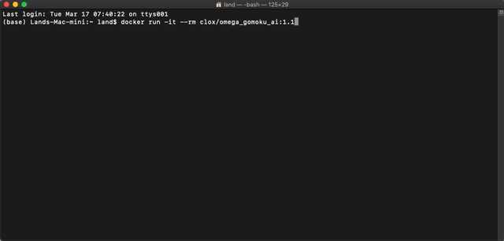
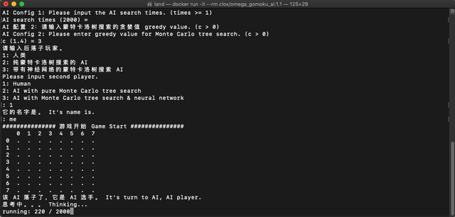
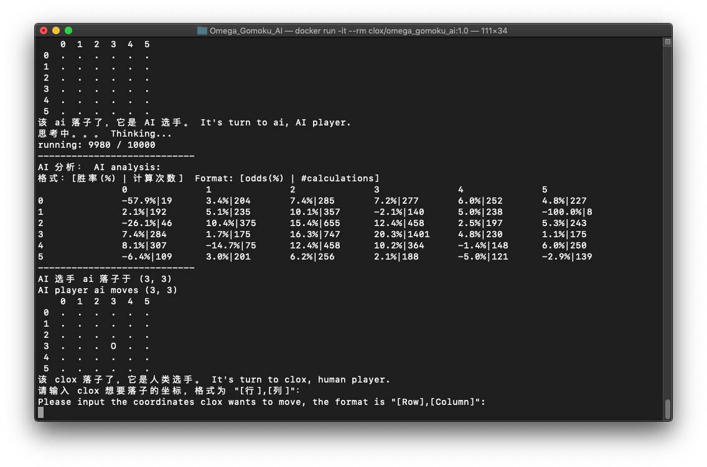
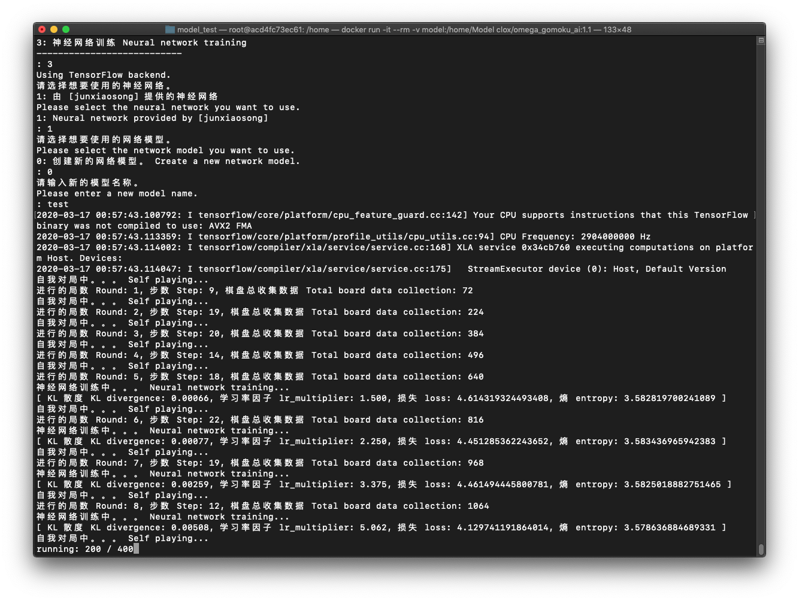

[](https://starkidstory.com)


# Omega_Gomoku_AI

**Omega_Gomoku_AI** 是一个基于蒙特卡洛树搜索 (MCTS) 算法的五子棋 AI 游戏，用 Python 铸造，神经网络部分使用 Keras 框架。

<p align="center">
<a href="https://starkidstory.com"></a>

<br/>
<a href="https://github.com/CLOXnu/Omega_Gomoku_AI/blob/master/README.zh-cn.md"></a>
</p>

**Omega_Gomoku_AI** 不仅用于五子棋游戏，你还可以自定义棋盘大小，以及几子连珠这样的游戏规则。例如井字棋，就是个 3 * 3 大小的棋盘，三子连珠。

此仓库提供~~可视化游戏界面~~，易用的训练过程，以及易于理解的代码。

玩得愉快～～

## 👣 开发路程

✅ 蒙特卡洛树搜索 -> ✅ 神经网络训练 -> 游戏可视化 -> 自定义博弈。

## 📖 参考文献和感谢

关于算法，**Omega_Gomoku_AI** 参考于这篇文章：[Monte Carlo Tree Search – beginners guide](https://int8.io/monte-carlo-tree-search-beginners-guide/)，作者是 [int8](https://github.com/int8)。

**Omega_Gomoku_AI** 受启发于 [AlphaZero_Gomoku](https://github.com/junxiaosong/AlphaZero_Gomoku) 和 [tictactoe_mcts](https://github.com/zhuliquan/tictactoe_mcts).


## 🏠 代码结构

- [start.py](start.py) - 开始游戏，人类 vs AI，AI vs AI， 人类 vs 人类 均可调。
- [train.py](train.py) - 训练脚本，可用不同网络和保存的模型进行训练。
- [configure.py](configure.py) - 配置游戏，包括棋盘尺寸，几子连珠，或者蒙特卡洛树的搜索次数。
- [game.conf](game.conf) - 配置文件。
- [Function.py](Function.py) - 一些功能函数。
- [console_select.py](console_select.py) - 一些控制台输入函数.
- [Game/](Game/)
  - [Game.py](Game/Game.py) - 抽象类 Game, 被控制台棋盘 (Console board) 和可视化棋盘 (Visual board) 实现。
  - [ConsoleBoard.py](Game/ConsoleBoard.py) - 控制台棋盘，实现类 Game.
- [Player/](Player/)
  - [Player.py](Player/Player.py) - 抽象类 Player, 被人类玩家 (Human) 和 AI 玩家实现。
  - [Human.py](Player/Human.py) - 人类玩家，实现类 Player.
  - [AI_MCTS.py](Player/AI_MCTS.py) - 纯蒙特卡洛树搜索的 AI 玩家，实现类 Player, MonteCarloTreeSearch.
  - [AI_MCTS_Net.py](Player/AI_MCTS_Net.py) - 蒙特卡洛树搜索 + 神经网络 AI 玩家，实现类 Player, MonteCarloTreeSearch.
- [AI/](Player/AI/) - AIs.
  - [MonteCarloTreeSearch.py](AI/MonteCarloTreeSearch.py) - 抽象类 MonteCarloTreeSearch，被所有使用蒙特卡洛树搜索的 AI 实现。
  - [MonteCarloTreeNode.py](AI/MonteCarloTreeNode.py) - 蒙特卡洛树节点的基类。
  - [Network/](AI/Network/) - 神经网络。
    - [Network.py](AI/Network/Network.py) - 抽象类 Network，被神经网络实现。
    - [PolicyValueNet_from_junxiaosong.py](AI/Network/PolicyValueNet_from_junxiaosong.py) - 一个策略价值网络, 作者是 [@junxiaosong](https://github.com/junxiaosong/AlphaZero_Gomoku)。
    - ~~PolicyValueNet_AlphaZero.py - AlphaZero 论文描述的策略价值网络。~~
- [Model/](Model/) - 模型。训练的数据将会保存于此。
    
    
## 用法

你可以自己尝试 **Omega_Gomoku_AI**，方法如下：

### 使用 Docker

如果你安装了 Docker，那么执行如下命令：

```shell
$ docker pull clox/omega_gomoku_ai:1.1
```

然后，执行：

```shell
$ docker run -it clox/omega_gomoku_ai:1.1
```

在 `-it` 后添加 `--rm` 可以在容器退出后自动删除容器。

以上是最简单版本的 Docker 容器配置方式，但如果你想要训练网络且希望将模型保存到本地，那么需要添加 `-v` 参数来挂载本地目录。

```shell
$ docker run -it -v [Path]:/home/Model clox/omega_gomoku_ai:1.1
```

这里的 `[Path]` 需要填写你想要挂载的本地目录，切记不可以是相对路径。

> *PS:*

> - 此 Docker 镜像的[主页 (clox/omega_gomoku_ai)](https://hub.docker.com/r/clox/omega_gomoku_ai)。
> - Docker 镜像的压缩大小约为 **493 MB**.
> - 此 Docker 镜像基于 [tensorflow/tensorflow:2.0.0-py3](https://hub.docker.com/layers/tensorflow/tensorflow/2.0.0-py3/images/sha256-0b236338fac6c3361cf3ae1448f8c053994e260c1edc4fa63ed80adb3045abb2?context=explore).
> - 如果你觉得 `docker pull` 的速度太慢，这里是中科大的 [Docker 加速器](http://mirrors.ustc.edu.cn/help/dockerhub.html?highlight=docker)。

#### 使用 Docker 运行最简单版本的示例

配置：



运行：




### 使用 PC/Mac/Linux

确保你的电脑安装了 Keras 的后端环境（Tensorflow），在获取这个仓库之后，运行：

```shell
$ pip install -r requirement.txt
```

必要时，命令 'pip' 可改为 'pip3'。

使用 Mac/Linux，只需运行：

```shell
$ bash game.sh
```

就够了。或者，分开运行：

```shell
$ python configure.py
```

来配置游戏，运行：

```shell
$ python start.py
```

来开始游戏。

```shell
$ python train.py
```

来训练网络。

无论何种方式都相当简单。


## 开始。。。

默认地，游戏会在 8 * 8 的棋盘上进行五子连珠游戏，并且纯蒙特卡洛树的 AI 玩家会进行每回合 2,000 次的搜索。


有时，纯蒙特卡洛树的 AI 玩家会执行一些诡异的落子，这是因为每回合 2,000 次的搜索对于五子连珠游戏太少了。所以你可以将棋盘大小设为 3 * 3，或是 6 * 6，设为三子连珠或是四子连珠，就像井字棋。

当然，把 2,000 次每回合的搜索次数改得更多也是个好主意，不过这样会牺牲时间。

现在，我们开放了贪婪值 (greedy value)，可以自行调节来改变蒙特卡洛树搜索的探索程度。



例如上图，我将蒙特卡洛树搜索次数调至 10,000，在 6 * 6 的棋盘进行 4 子连珠游戏，可以在 AI 分析中看出蒙特卡洛树几乎已经遍历了全部棋盘。

带有神经网络的蒙特卡洛树搜索的 AI 玩家会解决这个问题。

训练已经开放。




## 许可

**Omega_Gomoku_AI** 已获得 MIT 许可，详见 [LICENSE](LICENSE)。


## 未完待续。。。


